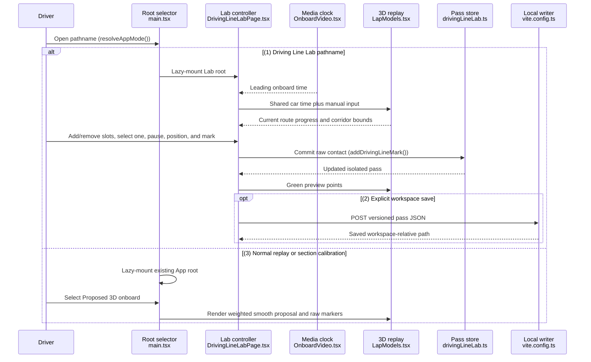
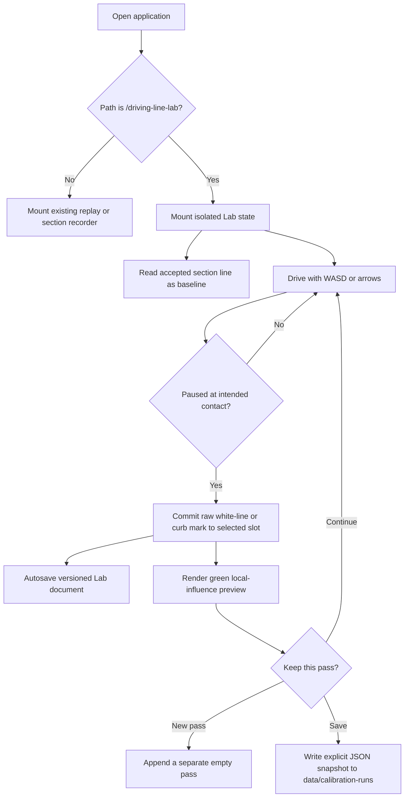

# Driving Line Lab Blueprint

The Driving Line Lab is an additive, local-first calibration surface for recording sparse white-line, curb, and reference contacts against the existing Montréal replay. It runs at `/driving-line-lab` as a sibling React root, reads the accepted section calibration as a baseline, stores its own versioned passes, and renders a green preview without promoting or overwriting the accepted driving line. A reviewed pass can also be bundled as a separate smooth proposal for comparison in the normal replay.

## Simple breakdown

Think of the existing section recorder as the official map and the Lab as tracing paper placed on top. You can drive the cursor, pin green notes where the real car touches an edge, save multiple sheets, and compare them. The official map remains underneath and is never erased or replaced by a Lab pass.

## Visual architecture

The main story has one alternative: the pathname chooses either the normal replay/calibration root or the Lab root. Saving to the workspace is optional and happens only after an explicit button press.

`resolveAppMode()`
(Selects the sibling application from the current pathname.)

`addDrivingLineMark()`
(Adds or replaces one numbered route-relative contact in the selected pass.)

The decision flow keeps draft data separate from accepted calibration data:

## Component breakdown

### Root isolation

[`src/main.tsx`](../../src/main.tsx)
Repo: The-Onboard

Chooses one lazy-loaded root. The existing application and its section-recorder effects never mount on the Lab endpoint.

[`src/routing.ts`](../../src/routing.ts)
Repo: The-Onboard

Owns the small, testable pathname contract. `/driving-line-lab` takes precedence even if unrelated query parameters are present.

### Playback and manual placement

[`src/features/replay/calibration/DrivingLineLabPage.tsx`](../../src/features/replay/calibration/DrivingLineLabPage.tsx)
Repo: The-Onboard

Owns the Lab-only playback clock, keyboard state, manual lateral position, camera view, pass selection, and explicit export actions. Aerial positioning shows the real footage 0.5 seconds ahead for steering anticipation; switching to 3D onboard comparison reseeks the footage to the same canonical vehicle lap time.

[`src/features/replay/components/OnboardVideo.tsx`](../../src/features/replay/components/OnboardVideo.tsx)
Repo: The-Onboard

Supports an optional post-lap media tail so the aerial positioning preview can remain 0.5 seconds ahead while the 3D car still reaches the official finish line. Exact onboard comparison uses no extension.

[`src/features/replay/calibration/drivingLineLabClock.ts`](../../src/features/replay/calibration/drivingLineLabClock.ts)
Repo: The-Onboard

Defines the reversible car-time/video-time mapping for both modes: a half-second aerial preview and a zero-offset onboard comparison. Changing views preserves canonical car time and changes only the source-video seek.

[`src/features/replay/calibration/DrivingLineLabPanel.tsx`](../../src/features/replay/calibration/DrivingLineLabPanel.tsx)
Repo: The-Onboard

Exposes pass controls, lap progress, position feedback, a compact contact board that starts at 28 boxes and can expand to 128, per-pass add/remove controls, white-line/curb/reference-point types, mark and undo actions, camera switching, a perceptual 14–78 m aerial-distance control with explicit Closer/Farther endpoints, visible timing-mode status, and export status. Slots can be selected in any order. Selecting a completed slot pauses playback and restores its saved lap time, lateral position, and type so that marking again edits that exact observation.

### Storage and preview transformation

[`src/features/replay/calibration/drivingLineLab.ts`](../../src/features/replay/calibration/drivingLineLab.ts)
Repo: The-Onboard

Defines the versioned run and mark schema. Every pass stores its own one-based contact-slot count, defaulting legacy data and new passes to 28. Adding inserts a slot immediately after the selected contact and renumbers later observations; removing deletes the selected slot and renumbers later observations. Old browser marks are assigned deterministic slots during sanitization. Spatial identity is closed-route progress plus absolute lateral offset; video time remains provenance only.

[`src/features/replay/calibration/proposedDrivingLine.ts`](../../src/features/replay/calibration/proposedDrivingLine.ts), [`src/features/replay/calibration/proposedDrivingLineVariant2.ts`](../../src/features/replay/calibration/proposedDrivingLineVariant2.ts), and [`src/features/replay/calibration/proposedDrivingLinePass.ts`](../../src/features/replay/calibration/proposedDrivingLinePass.ts)
Repo: The-Onboard

Validate and analyze the bundled pass, then fit a bounded periodic cubic line with a lateral-acceleration penalty. Curb contacts and reference points in the final 3.5% of route progress before a curb are priority targets; ordinary straight references remain softer timing guidance. The penalty relaxes only around those corner targets so the fit can reach them without spreading curvature across the straights. The normal replay keeps the real video mounted top-left as the master clock and switches the single main 3D canvas to the proposal when selected in the navbar. The smooth green path remains distinct from the raw colored observations.

The first fit is exported unchanged as proposed onboard 1. Proposed onboard 2 adds a separate set of compact, zero-slope correction windows for the reviewed T5, T6, T8, T9, T10, and T14 issues. It never mutates or refits onboard 1. The correction table is sampled twice as densely and circularly smoothed before composition to prevent local edits from introducing a one-frame lateral snap; protected T13 and T14-exit anchors remain effectively unchanged. Both versions use the same 64 raw markers, media master clock, and 3D timing offset.

[`src/features/replay/scene/DrivingLinePreview.tsx`](../../src/features/replay/scene/DrivingLinePreview.tsx)
Repo: The-Onboard

Samples the existing scalar lateral-offset model only inside each raw mark's local influence, projects height onto confirmed driveable road, and draws those green spans slightly above the surface. Unmarked parts of the accepted baseline stay visible in their normal styling rather than being presented as Lab-authored output.

[`vite.config.ts`](../../vite.config.ts)
Repo: The-Onboard

Adds a development-only POST endpoint that writes an explicitly saved pass to `data/calibration-runs/<pass-id>.json` for later agent-assisted fitting and comparison.

## Data contract

Each raw mark records a stable identifier, contact slot, wrapped route progress, absolute lateral offset, source lap time, corridor bounds, road fraction, route-relative side, contact type (`white-line`, `curb`, or `ref-point`), tolerance, and timestamp. A slot can contain at most one mark, and mark or board-structure changes are undoable during the session. Each run keeps its own identifier, timestamps, and slot count. The document also pins replay, route, corridor, and fitter versions so incompatible passes fail visibly instead of being combined silently.

Generated green samples are derived preview data and are not stored as user observations. Reference markers are blue so they remain distinguishable from white-line and curb contacts. A pass reaches completion when its saved count equals its current box count and remains editable. Starting a new pass appends a separate 28-box run; it does not clear or merge earlier runs. A pass can contain at most 128 boxes.

Direct 3D onboard comparison keeps the video clock unchanged and applies a browser-persisted visual vehicle-time correction only to the 3D route sample. It defaults to +0.10 seconds and is adjustable from -0.50 to +0.50 seconds in 0.01-second steps. Aerial positioning keeps its separate +0.50-second video preview lead.

## Security, performance, and observability

- Integrity: the development writer accepts only schema version 1, replay `9527:63:22`, the locked route version, a safe pass identifier, and an array of marks. Payloads over 1 MB are rejected.
- Scope: the writer resolves one fixed workspace directory and never accepts a client-supplied output path. Browser autosave uses a new Lab-only storage key and does not write section, sync, or accepted-line keys.
- Performance: each endpoint lazy-loads its own root. Green geometry is memoized and sampled at roughly 1.8-metre intervals with a fixed upper bound; it is rebuilt only when the route or selected marks change. Proposal review reuses the main 3D canvas, so it does not mount a second renderer.
- Resilience: malformed or version-mismatched browser data falls back to a fresh empty pass. A failed workspace save leaves the browser draft intact and displays the failure in the panel.
- Observability: replay-load failures use a Lab-specific console prefix, the panel reports autosave/workspace-save state, and the saved JSON contains enough context to reproduce or reject a later fit.

## Promotion boundary

The Lab intentionally has no “Apply to official line” action. The bundled fit is a reviewable proposal, not an overwrite or implicit promotion. A later review step can revise the raw pass, compare another fit, and only then introduce an explicit promotion workflow. Until that exists, the accepted section calibration remains authoritative.
